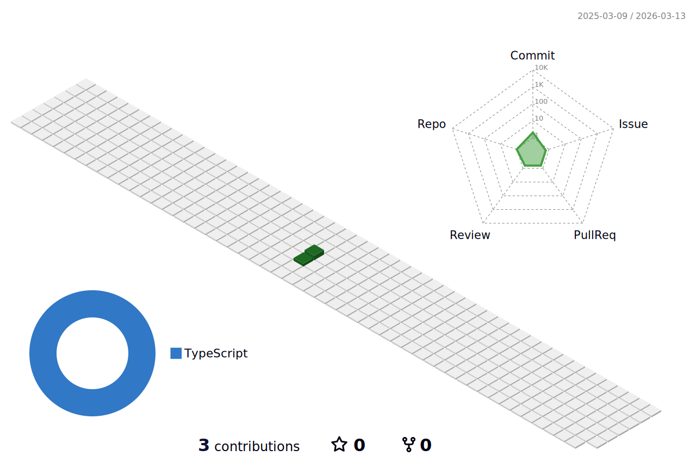

  <h2>Hi there 👋 
    I'm Juan Ospina but I'm called "PildoDev" 
    And this is my github profile
    
  </h2>

<!--  -->

	<picture>
	  <source media="(prefers-color-scheme: dark)"  srcset="./profile-3d-contrib/profile-night-green.svg" />
	  <source media="(prefers-color-scheme: light)" srcset="./profile-3d-contrib/profile-green-animate.svg" />
	  
	</picture>

   

    <h4>Core Skills:</h4>
    <table>
        <tr>
            <th>Logo</th>
            <td align="center"></td>
            <td align="center"></td>
            <td align="center"></td>
            <td align="center"></td>
            <td align="center"></td>
        </tr>
        <tr>
            <th>Name</th>
            <td>HTML5</td>
            <td>CSS3</td>
            <td>JavaScript</td>
            <td>Java</td>
            <td>Python</td>
        </tr>
        <tr>
            <th>Knowledge level</th>
            <td>SKILLED</td>
            <td>SKILLED</td>
            <td>SKILLED</td>
            <td>SKILLED</td>
            <td>SKILLED</td>
        </tr>
    </table>

    <h4>Frameworks & Libraries:</h4>
    <table>
        <tr>
            <th>Logo</th>
            <td align="center"></td>
            <td align="center"></td>
            <td align="center"></td>
            <td align="center"></td>
            <td align="center"></td>
        </tr>
        <tr>
            <th>Name</th>
            <td>Angular</td>
            <td>React</td>
            <td>Laravel</td>
            <td>Wordpress</td>
            <td>ViteJs</td>
        </tr>
        <tr>
            <th>Knowledge level</th>
            <td>SKILLED</td>
            <td>SKILLED</td>
            <td>SKILLED</td>
            <td>SKILLED</td>
            <td>SKILLED</td>
        </tr>
    </table>

    <h4>Game Development:</h4>
    <table>
        <tr>
            <th>Logo</th>
            <td align="center"></td>
        </tr>
        <tr>
            <th>Name</th>
            <td>Unity</td>
        </tr>
        <tr>
            <th>Knowledge level</th>
            <td>SKILLED</td>
        </tr>
    </table>

    <h4>Other Skills:</h4>
    <table>
        <tr>
            <th>Logo</th>
            <td align="center"></td>
            <td align="center"></td>
            <td align="center"></td>
        </tr>
        <tr>
            <th>Name</th>
            <td>Numpy</td>
            <td>Pandas</td>
            <td>TensorFlow</td>
        </tr>
        <tr>
            <th>Knowledge level</th>
            <td>SKILLED</td>
            <td>SKILLED</td>
            <td>SKILLED</td>
        </tr>
    </table>

